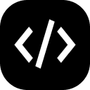

# Bionic Reading: Cyber-Optical Augmented Engine

Enhance your reading experience with this high-performance Chrome extension that applies patented bionic reading techniques to any website. It uses a sophisticated **"Cyber-Optical"** design system, a robust **Effect-TS** orchestration framework, and a **Rust WebAssembly (WASM)** processing core.

[](https://github.com/scuba3198/bionic-reading/releases)
[](LICENSE)

## Features

- **Rust WebAssembly Core**: High-performance text tokenization and formatting compiled to Wasm. Implements the exact **Typo1 algorithm from patent DE102017112916A1**.
- **100% CSP-Immune**: WebAssembly execution is offloaded to the extension's background service worker, completely bypassing strict Content Security Policies (CSP) on secure sites like GitHub and Twitter.
- **Stop-Words Bypass**: Bypasses formatting for common English/German stop words (`the`, `and`, `to`, `der`, `die`, `das`) to maintain a natural visual flow.
- **Keyboard Shortcut (`Alt+B`)**: Toggle the bionic engine instantly from any page.
- **Reactive UI Synchronization**: The popup UI reactively syncs with storage changes, updating status labels, colors, and button states in real-time when toggled via hotkey.
- **SPA & Dynamic Mutation Support**: Automatically processes new elements on dynamic pages using `MutationObserver` and batched text walker queues.
- **Cyber-Optical UI**: A premium, "Augmented Reality" inspired interface featuring Glassmorphic panels, blueprint borders, and IBM Plex Mono typography.

## Build and Development

### Prerequisites
Make sure you have [Node.js](https://nodejs.org/) (v18+), [Rust/Cargo](https://www.rust-lang.org/), and [wasm-pack](https://rustwasm.github.io/wasm-pack/) installed:
```bash
npm install -g wasm-pack
```

### Building the Extension
1. Clone the repository.
2. Install dependencies:
   ```bash
   npm install
   ```
3. Run the complete build pipeline (compiles WASM, inlines binary, bundles popup/worker/content scripts via Vite, and copies assets):
   ```bash
   npm run build
   ```

### Loading in Chrome
1. Open Chrome and navigate to `chrome://extensions/`.
2. Enable **"Developer mode"** in the top right corner.
3. Click **"Load unpacked"** and select the **`dist/`** directory inside the project root folder.

> [!IMPORTANT]
> Always load the `dist/` subfolder, not the root project folder. The root folder is the source directory, while the `dist/` folder contains the compiled, self-contained extension assets.

## Usage

1. Click the **Bionic Reading** icon in your browser toolbar or press **Alt+B** to toggle the bionic enhancement on the active tab.
2. If the active tab is an internal browser page (e.g. `chrome://`), the extension status changes to **RESTRICTED** to prevent injection errors.
3. On standard webpages, the text is automatically parsed, formatted, and highlighted in bionic reading style.

## Design Philosophy

Inspired by "Augmented Intelligence" and "Cyber-Precision," the interface uses a dark-obsidian palette with vibrant teal accents. The blueprint-style borders and scanline textures reflect the "Bionic" nature of the tool—augmenting human biological reading patterns with digital precision.

## Credits

Originally developed by [@aktoriukas](https://github.com/aktoriukas). This version is a comprehensive refactor featuring a new WebAssembly engine and design system.

---

*Made with precision for the augmented mind.*
